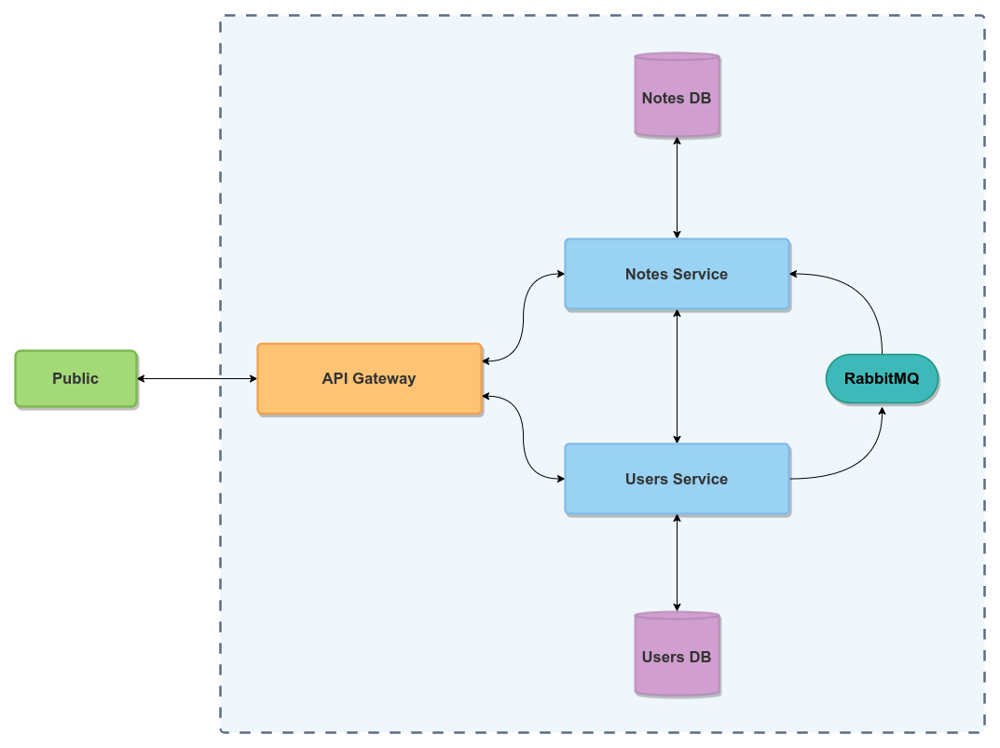
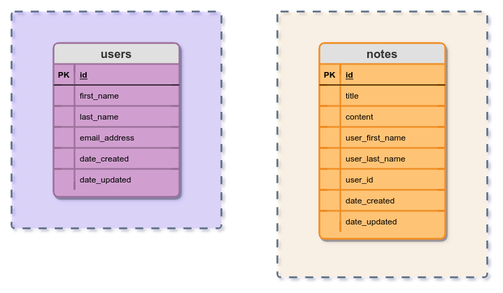

# Spring Notes Microservices - Quickstart Guide

This is a simple notes microservices application which makes use of Spring Cloud to illustrate the principles of microservices and get you going when you're building your own projects

## Architecture overview

- Public
  - This denotes all the incoming request to our application
  - Think of this as the end-user, the client, or a random person who uses our application to store their notes
  - As can be seen data flows back and forth from the requester to the API Gateway, this is because the API Gateway serves as a single entry point into our application, and will be the only public link to the outside world to communicate with
- API Gateway
  - This serves as a single entry point into our application
  - It delegates traffic based on the incoming request to the specific microservice and handles the responses to the requester
  - We don't want anybody to connect directly to our microservices, unless specifically intended
- Notes Service
  - This microservice will handle all the business logic of our application within the notes domain
- Notes Database
  - As a microservice should own its own data, only the notes service will interact with this database
  - In this case the database will be a relational database
- Users Service
  - This microservice will handle all the business logic of our application within the users domain
- Users Database
  - Only the users service will interact with this database as it owns the schema and data related to it
  - In this case the database will be a relational database
- Notes-Users connection
  - This connection denotes that data is flowing directly between the notes service and the users service.
  - To illustrate the option of calling another microservice directly, I've modeled the note entity so that it has meta-data information about the user (the firstname, lastname and userID). Everytime a note is created it will fetch the user
    information based on the userID creating the note and extract the required fields (remember this is just for illustration purposes, in a real world application you should minimize calls as this adds unnecessary lag). What is bad about calling
    another microservice directly is the fact that we now introduce tight coupling between two or more services. We are now reliant on the users service being available and in working condition to insert a new note (again in a real world application
    you should model this differently if you can).
  - In a future part of the series we'll see how this can be done and discuss it in more detail
- RabbitMQ
  - I've added RabbitMQ to the system as this is needed to illustrate the workings of asynchronous communication between microservices
  - As can be seen the users service publishes data to the queue and the notes service consumes the data from the queue
  - This is to facilitate for asynchronously updating user meta-data on notes once a user is updated in the users service. The update will happen behind the scenes automatically.
  - In a future part of the series we'll discuss this in more detail.

## Databases ERDs

Our two database tables look as follows:

As can be seen in the image above, the database are quite simple in design and are used for the sake of illustrating the fact that a microservice should own its data entities where possible.

## Summary

- We'll be making use of an API Gateway which has an internal load balancer and delegates traffic to the related microservices based on an incoming request
- The API Gateway serves as a single entry point to our services
- We'll take a look at how synchronous communication works directly between microservices
- We'll take a look at how asynchronous communication works between microservices
- We'll be evolving our architecture over time as all architectures should be iterable over time
- We'll be adding new functionality as the blog series progresses in the future

# Up and Running

## Prerequisites

- Git installation and configured
- Access to a Terminal window, or CommandPrompt with Git installed
- REST client such as Postman or Insomnia

## Steps to run locally

- Clone project
- Import into your favorite IDE (such as IntelliJ IDEA)
- Run modules in sequence
  - Discovery Server
  - API Gateway
  - User Service
  - Notes Service

## Eureka Server

- You can monitor the various services managed by `Eureka` by visiting [http://localhost:8761/](http://localhost:8761/) on your web browser
- All the services make use of `Spring Actuator`, and you will see the status of each service "discovered" on the web portal

